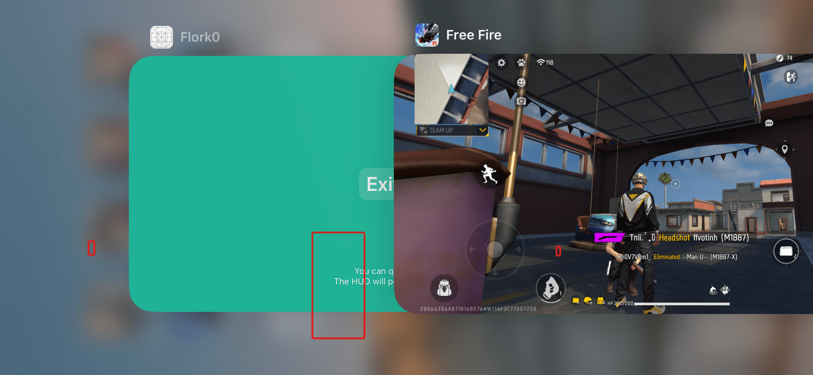

# External ESP Free Fire

Project external ESP logic, based on TrollSpeed UI.

<br>
<p align="center">
  
  &nbsp; &nbsp;
  
</p>
<br>

> **Note:** Write-up coming soon.

---

## Legal & Ethical Disclaimer
**THIS PROJECT IS STRICTLY FOR EDUCATIONAL AND ACADEMIC PURPOSES ONLY.**
* The author is not responsible for any misuse, damage, or legal issues caused by this software.
* Using this tool on official game servers may result in a permanent account **BAN**.

---

## Features
* **Core ESP Logic:** Basic ESP (Box, Health, Name) is implemented.

---

### Project Structure:
```
External_ESP_Free_Fire/
├── esp/Core                 # Core ESP logic
├── headers/
├── layout/
├── sources/
├── makefile
└── README.md
```

---

### To-Do List:
- [ ] **On-screen rendering:** Display `Name Player` and `Health Player` (Logic already in source).
- [ ] **Process Cleanup:** `TrollSpeed-hud` process remains active in the background even after **exiting** the HUD. 
  *(Note: This stems from the current custom UI. If you can't fix it, consider reverting to original [TrollSpeed](https://github.com/Lessica/TrollSpeed) source).*
- [ ] **Optimization:** Reduce CPU/GPU overhead in the rendering pipeline.
- [ ] **Customization:** Add configuration file support for user settings.

---

## Installation & Build
### Requirements:
* A device with **[TrollStore](https://github.com/opa334/TrollStore)** installed is required to run this application
* Ensure you have **[Theos](https://theos.dev/)** installed.

### Steps:
1. **Clone the repository:**
   ```bash
   git clone https://github.com/Fl0rk/External_ESP_Free_Fire.git
   cd External_ESP_Free_Fire
   ```

2. **Building from Source:**
   ```bash
   make clean package
   ```

---

## Credits
* **Core ESP Logic:** Created and maintained by **Fl0rk**.
* **Original UI:** [TrollSpeed](https://github.com/Lessica/TrollSpeed) by **Lessica**.
* **Custom UI Design:** [Excalibur_v.2.0](https://github.com/andrd3v/Excalibur_v.2.0) by **andrd3v**.

---

## License
This project is licensed under the **GNU Affero General Public License v3.0 (AGPL-3.0)** - see the [LICENSE](LICENSE) file for details.
